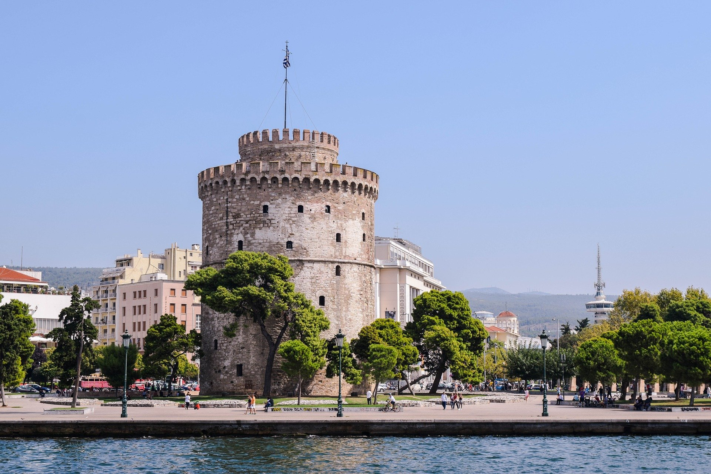

# Dates and location

The Rust All Hands 2020 will be taking place between **March 16th-20th** at the
[University of Macedonia][uom] in Thessaloníki, Greece.

## Venue Location

156 Egnatia Street, 
GR-546 36 Thessaloniki, 
Greece

<iframe src="https://www.google.com/maps/embed?pb=!1m18!1m12!1m3!1d3028.0761271769256!2d22.955177215835537!3d40.628203079341155!2m3!1f0!2f0!3f0!3m2!1i1024!2i768!4f13.1!3m3!1m2!1s0x14a838fe0b32e959%3A0xa9c81b906d8cd134!2sEgnatia%20156%2C%20Thessaloniki%20546%2036%2C%20Greece!5e0!3m2!1sen!2sde!4v1578773528689!5m2!1sen!2sde" width="600" height="450" frameborder="0" style="border:0;" allowfullscreen=""></iframe>

## Hotel Recommendations

[UoM] has provided attendees with a list of hotels, that can be booked with their
corporate rate. **Note** Some people have said they have found some of the
hotels with cheaper listings through booking portals. Be sure to try and find
the cheapest and most convenient option for you.

**DISCOUNT CODE:** ALL HANDS

### Hotel ABC

- **Website:** [hotelabc.gr](https://hotelabc.gr)
- **Address:** Aggelaki str. 41
- **Price (per night):**
  - Single bed: €56
  - Double bed: €72
- **Details:**
  - Greek buffet breakfast
  - Free WiFi
- **Commute:**
  - 1 minute from Bus stop.
  - 8 minutes walking distance to/from University.

### Metropolitan Hotel

- **Website:** [www.metropolitan.gr](https://www.metropolitan.gr)
- **Address:** Vas. Olgas Ave. 65
- **Price (per night):**
  - Single bed: €60
  - Double bed: €70
- **Details:**
  - Greek buffet breakfast
  - Room tax (€3 a day)
  - Free WiFi
- **Commute:**
  - 1 minute from bus stop.
  - 8 minutes walking distance to/from University.

### Μediterranean Palace Hotel

- **Website:** [www.mediterranean-palace.gr](https://www.mediterranean-palace.gr)
- **Address:** Salaminos & Karatassou str. 3
- **Price (per night):**
  - Single bed: €100
  - Double bed: €110
- **Details:**
  - Greek buffet breakfast
  - Free outdoor parking
  - Indoor parking (€10/day)
  - Free WiFi
- **Commute:**
  - 2 minutes from bus stop.

### Colors Thess Living

- **Website:** [colors.com.gr](https://colors.com.gr/)
- **Address:** Valaoritou Str. 21
- **Price (per night):**
  - Single bed: €70
  - Double bed: €75
- **Details:**
  - +€5 breakfast
- **Commute:**
  - 1 minute from bus stop.
  - 20 minutes from university.

## Location Photos

Image by [Emilia Babalau-Maghiar][emilia-babalau-maghiar]

Image by [Dimitris Vetsikas][dimitris-vetsikas]

Image by [Dimitris Vetsikas][dimitris-vetsikas]

Image by [Dimitris Vetsikas][dimitris-vetsikas]

[emilia-babalau-maghiar]: https://pixabay.com/users/emiliamaghiar-2470335/
[dimitris-vetsikas]: https://pixabay.com/users/dimitrisvetsikas1969-1857980/
[uom]: https://www.uom.gr/en
